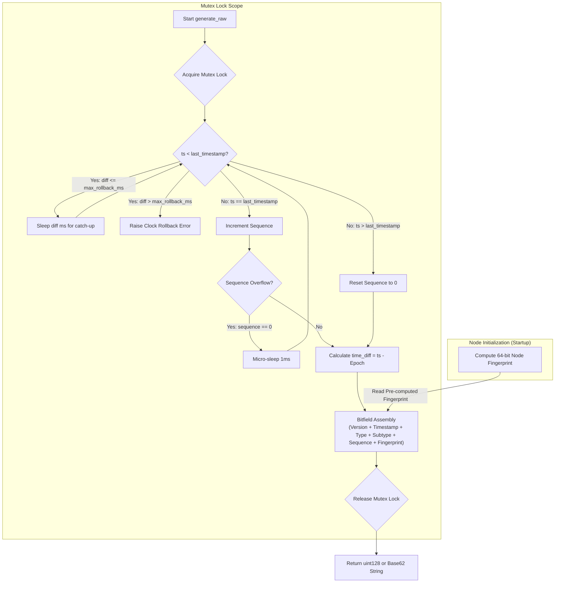
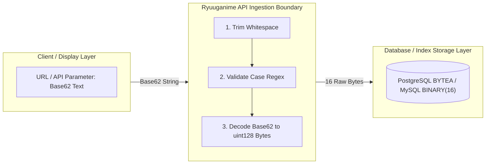

<!-- SPDX-License-Identifier: CC-BY-4.0 -->
# Ryuuganime Snowflake ID Specification (v0)

This document defines the formal specification for **Ryuuganime Snowflake ID**, a 128-bit, decentralized, time-ordered identifier designed for distributed database architectures and high-performance B-Tree indexing.

The key words "MUST", "MUST NOT", "REQUIRED", "SHALL", "SHALL NOT", "SHOULD", "SHOULD NOT", "RECOMMENDED", "NOT RECOMMENDED", "MAY", and "OPTIONAL" in this document are to be interpreted as described in [RFC 2119](https://datatracker.ietf.org/doc/html/rfc2119).

---

## 1. Executive Summary & Design Principles

1. **Native Database Indexing Speed:** Structured as a 128-bit unsigned integer ($2^{128} - 1$, 16 big-endian raw bytes) to allow native database primary key B-Tree indexing without text padding overhead.
2. **Compact Web Presentation:** Uses unpadded **Base62 text encoding** (`0-9a-zA-Z`, 11 to 22 characters) for web URLs and APIs.
3. **Strict Case Sensitivity:** Base62 text representations are case-sensitive. Ingestion boundaries MUST NOT alter string casing.
4. **Decentralized Coordination:** Node identities use a 64-bit cryptographic hash modulo, eliminating central coordination services (ZooKeeper, Redis counter).

---

## 2. Bit Layout & Field Allocations

A Ryuuganime Snowflake ID consists of 128 bits total, allocated across six distinct fields:

```
127          125 124                          83 82       78 77          74 73              64 63                             0
+---------------+-------------------------------+-----------+--------------+------------------+-------------------------------+
| Version       | Timestamp                     | Type      | Subtype      | Sequence         | Node Fingerprint              |
| (3 bits)      | (42 bits)                     | (5 bits)  | (4 bits)     | (10 bits)        | (64 bits)                     |
+---------------+-------------------------------+-----------+--------------+------------------+-------------------------------+
```

### 2.1 Bitfield Specification

| Field Name           | Bit Range  | Size    | Value Range                       | Description                                                                                                                                                                                          |
| :------------------- | :--------- | :------ | :-------------------------------- | :--------------------------------------------------------------------------------------------------------------------------------------------------------------------------------------------------- |
| **Version**          | `125..127` | 3 bits  | `0` (`0b000`)                     | Layout version. Version `0` is the active specification. Values `1..7` are reserved.                                                                                                                 |
| **Timestamp**        | `83..124`  | 42 bits | `0 .. 4,398,046,511,103`          | Milliseconds since Ryuuganime Epoch (`2026-07-01T00:00:00Z`, Unix millis `1782864000000`). Epoch chosen to align with the date of ID system implementation. Valid for 139.4 years (until Year 2165). |
| **Type**             | `78..82`   | 5 bits  | `0 .. 31`                         | Top-level entity domain category class (Section 5).                                                                                                                                                  |
| **Subtype**          | `74..77`   | 4 bits  | `0 .. 15`                         | Subcategory role within the entity domain class (Section 5).                                                                                                                                         |
| **Sequence**         | `64..73`   | 10 bits | `0 .. 1023`                       | Per-millisecond rolling counter (up to 1,024 IDs/ms per node = 1,024,000 IDs/sec).                                                                                                                   |
| **Node Fingerprint** | `0..63`    | 64 bits | `0 .. 18,446,744,073,709,551,615` | Cryptographic SHA-256 hash modulo $2^{64}$ of system identity.                                                                                                                                       |

---

## 3. Node Identity & Fingerprint Computation

To prevent ID collisions across microservices without central lock servers, each node computes a 64-bit Node Fingerprint at initialization:

$$\text{Node Fingerprint} = \text{SHA256}(\text{System Identity}) \pmod{2^{64}}$$

### 3.1 System Identity Strings

The system identity string **MUST** incorporate worker pod identifiers alongside hardware attributes:

- Environment Worker / Pod ID (`WORKER_ID`, `POD_NAME`, container hostname)
- System Hardware Serial Number / MAC Address / Host IP

### 3.2 Collision Probability & Cluster Fallback

Across $10,000$ active generator nodes in a cluster, collision probability is low ($P \approx 2.7 \times 10^{-11}$). Because fingerprint computation is stateless, collisions cannot be detected during generation.

- If a database `UNIQUE` constraint violation occurs across worker nodes, deployment orchestrators **MUST** re-seed colliding nodes by appending a worker ordinal or salt (`f"{system_identity}|salt:{worker_ordinal}"`).

---

## 4. Generation Lifecycle & Thread Safety

### 4.1 Generation Rules

1. **Version:** Generators MUST set Version = `0` (`0b000`).
2. **Epoch:** Custom Epoch is fixed at `2026-07-01T00:00:00Z` (Unix millis: `1782864000000`). The epoch is set to the date closest to the actual ID system implementation to minimize wasted timestamp space. Timestamps in generated IDs MUST be non-negative elapsed milliseconds since this epoch.
3. **Concurrency Safety:** Implementations MUST enforce mutual exclusion across timestamp calculation, sequence incrementation, and bitfield assembly. Synchronous contexts MUST use `threading.Lock()`. Asynchronous contexts (e.g., FastAPI, aiohttp) MUST use `asyncio.Lock()` or execute generation within a thread pool executor.
4. **Clock Rollback Tolerance:** Generators SHOULD accept a configurable parameter `max_rollback_ms` (default `10ms`, valid range `[0, 1000]ms`). Setting `max_rollback_ms = 0` is NOT RECOMMENDED. Values above `500ms` are NOT RECOMMENDED as they risk prolonged generation stalls under moderate clock skew.
   - If clock moves backward by `<= max_rollback_ms`, pause thread until clock catches up to `last_timestamp`.
   - If clock moves backward by `> max_rollback_ms`, raise `Clock Rollback Error`.
5. **Sequence Overflow:** If sequence reaches `1023` in the same millisecond, micro-sleep (`1ms`) until the clock advances to reset sequence to `0`.
6. **Isolated Timestamp Testing:** The optional `current_ts` parameter is reserved for testing/backdating and MUST NOT mutate `self.last_timestamp`.

### 4.2 Generation Sequence Flow



---

## 5. Representation, Normalization & Ingestion Boundaries

- **Client Display Layer (Base62 Text):** Display layers emit clean, unpadded Base62 strings (`0-9a-zA-Z`, 11 to 22 chars, e.g. `/user/czQ8gSaBPT8r5RPz`). Optional 22-character zero-padding (`pad=True`) MAY be enabled for fixed-width text formatters.
- **Client Validation Regex:** Frontend schemas MUST validate string inputs with `^[0-9a-zA-Z]{11,22}$`.
- **Strict Case Sensitivity & Error Handling:** Base62 text encoding is case-sensitive (`0-9a-zA-Z`). API boundaries **MUST NOT** normalize casing. Submitting a case-altered string MUST return an explicit `HTTP 404 Entity Not Found` or `HTTP 400 Bad Request` error.
- **Database Ingestion Boundary:** API middleware **MUST** decode Base62 strings into raw 128-bit unsigned integers or 16-byte big-endian binary bytes (`BYTEA` / `BINARY(16)`) prior to database execution.

### 5.1 System Boundary Architecture Flow



---

## 6. Type and Subtype Registry

| Type      | Type Name            | Subtype | Subtype Name                  |
| :-------- | :------------------- | :------ | :---------------------------- |
| **0**     | User                 | 0       | Account                       |
|           |                      | 1       | Media Activity (history)      |
|           |                      | 2       | Scrobble (current progress)   |
|           |                      | 3       | Post                          |
|           |                      | 4       | Comment                       |
|           |                      | 5       | Direct Message Thread         |
|           |                      | 6       | Direct Message Reply          |
|           |                      | 7       | Media Commentary (review)     |
| **1**     | User List            | 0       | User List, Unique: Current    |
|           |                      | 1       | User List, Unique: Completed  |
|           |                      | 2       | User List, Unique: Planned    |
|           |                      | 3       | User List, Unique: Paused     |
|           |                      | 4       | User List, Unique: Dropped    |
|           |                      | 5       | User List, Unique: Hidden     |
|           |                      | 6       | User List: Collected          |
|           |                      | 7       | User List: Favorite           |
|           |                      | 8       | Entry                         |
|           |                      | 9       | Reactions                     |
|           |                      | 15      | Custom List / Unspecified     |
| **2-3**   | _Reserved_           | -       | -                             |
| **4**     | Media                | 0       | Franchise or Universe         |
|           |                      | 1       | Show or Movie                 |
|           |                      | 2       | Book                          |
|           |                      | 3       | Music                         |
|           |                      | 4-5     | _Reserved_                    |
|           |                      | 6       | Season or Volume or Version   |
|           |                      | 7       | Cour or Part                  |
|           |                      | 8       | Episode or Chapter            |
| **5**     | Release Information  | 0       | Distribution Platform         |
|           |                      | 1       | Regular Schedule              |
|           |                      | 2       | Release Event                 |
| **6**     | Entity               | 0       | Person                        |
|           |                      | 1       | Character                     |
|           |                      | 2       | Company or Organization       |
| **7**     | Relationship         | 0       | Genre                         |
|           |                      | 1       | Theme                         |
|           |                      | 2       | Role                          |
|           |                      | 3       | Award                         |
|           |                      | 4       | Related title                 |
| **8**     | Mappings             | 0       | External Platform Mapping     |
|           |                      | 1       | Mapping                       |
| **9-10**  | _Reserved_           | -       | -                             |
| **11**    | Community            | 0       | Group                         |
|           |                      | 1       | Group Message                 |
|           |                      | 2       | Forum Thread                  |
|           |                      | 3       | News                          |
|           |                      | 4       | Community Event               |
|           |                      | 5       | Poll or Survey                |
| **12-13** | _Reserved_           | -       | -                             |
| **14**    | Client               | 0       | First Party                   |
|           |                      | 1       | Third Party                   |
|           |                      | 2       | Session                       |
| **15**    | Notification         | 0       | System                        |
|           |                      | 1       | In-App                        |
|           |                      | 2       | Webhook                       |
| **16**    | Feedback             | 0       | Thread                        |
|           |                      | 1       | Reply                         |
|           |                      | 2       | Action                        |
| **17**    | Log                  | 0       | Entry/Entity Revision Log     |
|           |                      | 1       | User-generated log            |
|           |                      | 2       | Mod log                       |
|           |                      | 3       | System log                    |
| **18**    | CDN / Media Asset    | 0       | Site Asset                    |
|           |                      | 1       | Profile Picture               |
|           |                      | 2       | Poster                        |
|           |                      | 3       | Backdrop                      |
|           |                      | 4       | Logo                          |
|           |                      | 5       | User Assets                   |
|           |                      | 6       | Promotional/Advert            |
| **19**    | Interaction          | 0       | Milestone                     |
|           |                      | 1       | Achievement and Badge         |
| **20**    | Distribution & Files | 0       | Distribution Group / Provider |
|           |                      | 1       | Media File                    |
| **21-30** | _Reserved_           | -       | -                             |
| **31**    | Uncategorized        | 15      | Uncategorized                 |

---

## 7. Reference Implementation (Python)

Below is the complete reference Python implementation with synchronous thread-safe and asynchronous asyncio-safe variants.

### 7.1 Shared Utilities

<details>
<summary>Shared Utilities (click to expand)</summary>

```python
import asyncio
import hashlib
import threading
import time
import asyncio
import hashlib
import threading
import time

# Epoch: 2026-07-01T00:00:00Z in Unix milliseconds (aligned with ID system implementation date)
RYUUGANIME_EPOCH = 1782864000000
SPEC_VERSION = 0  # 3 bits (0b000)
MOD_64_BIT = 1 << 64  # 2^64
MASK_64_BIT = MOD_64_BIT - 1

BASE62_ALPHABET = "0123456789abcdefghijklmnopqrstuvwxyzABCDEFGHIJKLMNOPQRSTUVWXYZ"


def compute_node_fingerprint(system_identity: str) -> int:
    """Computes a 64-bit node fingerprint using SHA-256 modulo 2^64."""
    sha256_hash = hashlib.sha256(system_identity.encode("utf-8")).digest()
    raw_int = int.from_bytes(sha256_hash, byteorder="big")
    return raw_int % MOD_64_BIT


def encode_base62(num: int, pad: bool = False) -> str:
    """Encodes a 128-bit integer to a Base62 string."""
    if num < 0 or num >= (1 << 128):
        raise ValueError("Cannot encode numbers outside 128-bit unsigned range.")
    if num == 0:
        return "0" * 22 if pad else "0"
    chars = []
    while num > 0:
        num, rem = divmod(num, 62)
        chars.append(BASE62_ALPHABET[rem])
    b62_str = "".join(reversed(chars))
    return b62_str.zfill(22) if pad else b62_str


def decode_base62(b62_str: str) -> int:
    """Decodes a Base62 string back to a 128-bit integer."""
    if not b62_str:
        raise ValueError("Base62 string cannot be empty.")
    num = 0
    for char in b62_str:
        if char not in BASE62_ALPHABET:
            raise ValueError(f"Invalid Base62 character: '{char}'")
        num = num * 62 + BASE62_ALPHABET.index(char)
    if num >= (1 << 128):
        raise ValueError("Decoded Base62 integer exceeds 128-bit unsigned range.")
    return num


def parse(snowflake_val: str | int | bytes) -> dict[str, int]:
    """Parses a Base62 string, raw 128-bit int, or 16-byte binary into components.

    Returns 'timestamp' as an absolute Unix millisecond timestamp (UTC).
    """
    if isinstance(snowflake_val, str):
        if not snowflake_val:
            raise ValueError("Base62 Snowflake string cannot be empty.")
        if len(snowflake_val) < 11 or len(snowflake_val) > 22:
            raise ValueError(
                "Base62 Snowflake string must be between 11 and 22 characters long."
            )
        num = decode_base62(snowflake_val)
    elif isinstance(snowflake_val, bytes):
        if len(snowflake_val) != 16:
            raise ValueError("Snowflake bytes must be exactly 16 bytes long.")
        num = int.from_bytes(snowflake_val, byteorder="big")
    elif isinstance(snowflake_val, int):
        if not (0 <= snowflake_val < (1 << 128)):
            raise ValueError("Snowflake integer must fit within 128 bits unsigned.")
        num = snowflake_val
    else:
        raise TypeError("Snowflake value must be a str, int, or bytes.")

    return {
        "version": (num >> 125) & 0x7,
        "timestamp": ((num >> 83) & 0x3FFFFFFFFFF) + RYUUGANIME_EPOCH,
        "type": (num >> 78) & 0x1F,
        "subtype": (num >> 74) & 0xF,
        "sequence": (num >> 64) & 0x3FF,
        "node_fingerprint": num & MASK_64_BIT,
    }
```

</details>

### 7.2 Synchronous Implementation (threading)

<details>
<summary>Synchronous Implementation (click to expand)</summary>

```python
class RyuuganimeSnowflake:
    def __init__(
        self,
        system_identity: str | None = None,
        raw_fingerprint: int | None = None,
        max_rollback_ms: int = 10,
    ):
        if not (0 <= max_rollback_ms <= 1000):
            raise ValueError("max_rollback_ms must be between 0 and 1000 ms.")

        if raw_fingerprint is not None:
            if raw_fingerprint < 0:
                raise ValueError("raw_fingerprint must be a non-negative integer.")
            self.node_fingerprint = raw_fingerprint % MOD_64_BIT
        elif system_identity is not None:
            self.node_fingerprint = compute_node_fingerprint(system_identity)
        else:
            raise ValueError(
                "Must provide either system_identity string or raw_fingerprint int."
            )

        self.sequence = 0
        self.last_timestamp = -1
        self.max_rollback_ms = max_rollback_ms
        self._lock = threading.Lock()
        self._last_was_override = False

    def generate_raw(
        self,
        type_id: int,
        subtype_id: int,
        current_ts: int | None = None,
        version: int = SPEC_VERSION,
    ) -> int:
        if not (0 <= version <= 7):
            raise ValueError("Version must be between 0 and 7 (3 bits).")
        if not (0 <= type_id <= 31):
            raise ValueError("Type ID must be between 0 and 31 (5 bits).")
        if not (0 <= subtype_id <= 15):
            raise ValueError("Subtype ID must be between 0 and 15 (4 bits).")

        with self._lock:
            is_ts_override = current_ts is not None
            ts = current_ts if is_ts_override else int(time.time() * 1000)

            if ts < self.last_timestamp:
                diff = self.last_timestamp - ts
                if diff <= self.max_rollback_ms:
                    time.sleep(diff / 1000.0)
                    ts = int(time.time() * 1000)
                else:
                    raise RuntimeError(
                        f"Clock moved backwards by {diff}ms (exceeds max_rollback_ms={self.max_rollback_ms}ms)."
                    )

            if is_ts_override:
                # Override: increment to avoid dups among overrides, don't update last_timestamp
                self.sequence = (self.sequence + 1) & 0x3FF
                if self.sequence == 0:
                    while ts <= self.last_timestamp:
                        time.sleep(0.001)
                        ts = int(time.time() * 1000)
                    self.sequence = 0
                self._last_was_override = True
            else:
                # Real-time: reset if timestamp advanced or previous call was override
                if ts == self.last_timestamp and not self._last_was_override:
                    self.sequence = (self.sequence + 1) & 0x3FF
                    if self.sequence == 0:
                        while ts <= self.last_timestamp:
                            time.sleep(0.001)
                            ts = int(time.time() * 1000)
                        self.sequence = 0
                else:
                    self.sequence = 0
                self._last_was_override = False
                self.last_timestamp = ts

            time_diff = ts - RYUUGANIME_EPOCH

            if time_diff < 0:
                raise ValueError(
                    "Current time is before the Ryuuganime epoch (2026-07-01T00:00:00Z)."
                )
            if time_diff >= (1 << 42):
                raise ValueError("Timestamp overflow (exceeds 42 bits).")

            return (
                (version << 125)
                | (time_diff << 83)
                | (type_id << 78)
                | (subtype_id << 74)
                | (self.sequence << 64)
                | self.node_fingerprint
            )

    def generate(
        self,
        type_id: int,
        subtype_id: int,
        current_ts: int | None = None,
        pad: bool = False,
        version: int = SPEC_VERSION,
    ) -> str:
        snowflake_128 = self.generate_raw(
            type_id=type_id,
            subtype_id=subtype_id,
            current_ts=current_ts,
            version=version,
        )
        return encode_base62(snowflake_128, pad=pad)

    def generate_bytes(
        self,
        type_id: int,
        subtype_id: int,
        current_ts: int | None = None,
        version: int = SPEC_VERSION,
    ) -> bytes:
        snowflake_128 = self.generate_raw(
            type_id=type_id,
            subtype_id=subtype_id,
            current_ts=current_ts,
            version=version,
        )
        return snowflake_128.to_bytes(16, byteorder="big")
```

</details>

### 7.3 Asynchronous Implementation (asyncio)

<details>
<summary>Asynchronous Implementation (click to expand)</summary>

```python
class AsyncRyuuganimeSnowflake:
    def __init__(
        self,
        system_identity: str | None = None,
        raw_fingerprint: int | None = None,
        max_rollback_ms: int = 10,
    ):
        if not (0 <= max_rollback_ms <= 1000):
            raise ValueError("max_rollback_ms must be between 0 and 1000 ms.")

        if raw_fingerprint is not None:
            if raw_fingerprint < 0:
                raise ValueError("raw_fingerprint must be a non-negative integer.")
            self.node_fingerprint = raw_fingerprint % MOD_64_BIT
        elif system_identity is not None:
            self.node_fingerprint = compute_node_fingerprint(system_identity)
        else:
            raise ValueError(
                "Must provide either system_identity string or raw_fingerprint int."
            )

        self.sequence = 0
        self.last_timestamp = -1
        self.max_rollback_ms = max_rollback_ms
        self._lock = asyncio.Lock()

    async def generate_raw(
        self,
        type_id: int,
        subtype_id: int,
        current_ts: int | None = None,
        version: int = SPEC_VERSION,
    ) -> int:
        if not (0 <= version <= 7):
            raise ValueError("Version must be between 0 and 7 (3 bits).")
        if not (0 <= type_id <= 31):
            raise ValueError("Type ID must be between 0 and 31 (5 bits).")
        if not (0 <= subtype_id <= 15):
            raise ValueError("Subtype ID must be between 0 and 15 (4 bits).")

        async with self._lock:
            is_ts_override = current_ts is not None
            ts = current_ts if is_ts_override else int(time.time() * 1000)

            if ts < self.last_timestamp:
                diff = self.last_timestamp - ts
                if diff <= self.max_rollback_ms:
                    await asyncio.sleep(diff / 1000.0)
                    ts = int(time.time() * 1000)
                else:
                    raise RuntimeError(
                        f"Clock moved backwards by {diff}ms (exceeds max_rollback_ms={self.max_rollback_ms}ms)."
                    )

            if ts == self.last_timestamp:
                self.sequence = (self.sequence + 1) & 0x3FF
                if self.sequence == 0:
                    while ts <= self.last_timestamp:
                        await asyncio.sleep(0.001)
                        ts = int(time.time() * 1000)
                    self.sequence = 0
            else:
                self.sequence = 0

            if not is_ts_override:
                self.last_timestamp = ts

            time_diff = ts - RYUUGANIME_EPOCH

            if time_diff < 0:
                raise ValueError(
                    "Current time is before the Ryuuganime epoch (2026-07-01T00:00:00Z)."
                )
            if time_diff >= (1 << 42):
                raise ValueError("Timestamp overflow (exceeds 42 bits).")

            return (
                (version << 125)
                | (time_diff << 83)
                | (type_id << 78)
                | (subtype_id << 74)
                | (self.sequence << 64)
                | self.node_fingerprint
            )

    async def generate(
        self,
        type_id: int,
        subtype_id: int,
        current_ts: int | None = None,
        pad: bool = False,
        version: int = SPEC_VERSION,
    ) -> str:
        snowflake_128 = await self.generate_raw(
            type_id=type_id,
            subtype_id=subtype_id,
            current_ts=current_ts,
            version=version,
        )
        return encode_base62(snowflake_128, pad=pad)

    async def generate_bytes(
        self,
        type_id: int,
        subtype_id: int,
        current_ts: int | None = None,
        version: int = SPEC_VERSION,
    ) -> bytes:
        snowflake_128 = await self.generate_raw(
            type_id=type_id,
            subtype_id=subtype_id,
            current_ts=current_ts,
            version=version,
        )
        return snowflake_128.to_bytes(16, byteorder="big")
```

</details>
